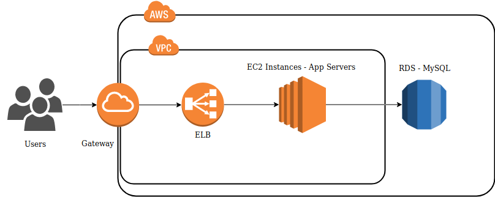
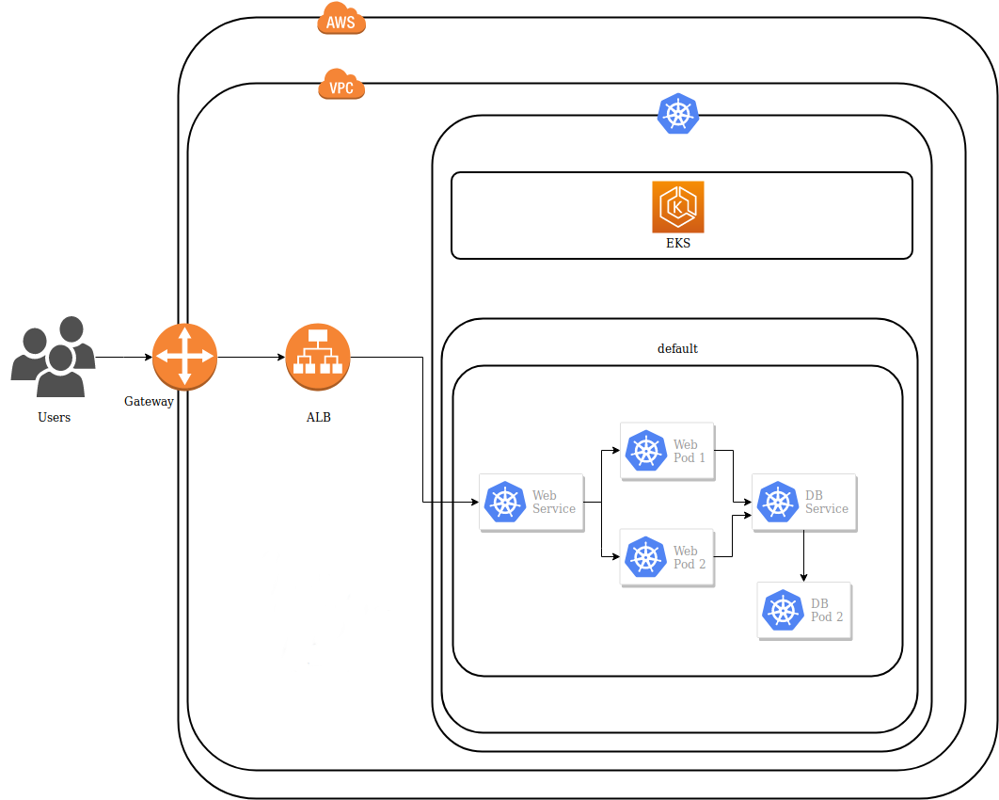

# Opensouthcode 2019
*Málaga / Spain*
*May 24 - 25, 2019*

Material para la presentación de [Terraform](https://www.terraform.io) en la [Opensouthcode 2019](https://www.opensouthcode.org/conferences/opensouthcode2019).

## Gestiona tu infraestructura como Código con Terraform

IaC (Infrastructure as code) es el proceso de gestión de una infraestructura (cloud o bare metal) mediante ficheros de configuración en lugar de configuraciones manuales. De este modo intentamos automatizar la creación, o incluso replicación, de nuestro entornos evitando fallos humanos, compartiendo el conocimiento (que antes sólo tendrían los administradores de sistemas que desplegaran dicho entorno) y gestionándolo con un sw de control de versiones.

Terraform es una herramienta de IaC desarrollada en Go por HashiCorp y compatible con la gran mayoría de proveedores de nube. Es una herramienta que nos provee un enfoque declarativo y tiene la capacidad de modificar la infraestructura existente para amoldarla a la que el usuario haya requerido utilizando un lenguaje de alto nivel HCL (Hashicorp Configuration Language).

Click :arrow_right: [aquí](https://www.opensouthcode.org/conferences/opensouthcode2019/program/proposals/189)

## Editar / Presentar

### Local Server

Ejecutar el server local.

```
$ ./server.sh
```

### Generar Web Estática

```
$ ./static.sh
```

## Ejemplos

### Ejemplo de Web Completa




### Ejemplo de Kubernetes (EKS)

